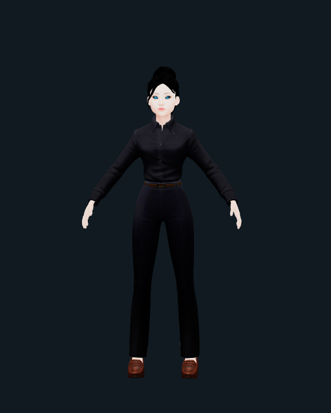

# A react app to show a 3d model
A 3d avatar view build using react and threejs.

[Model source](https://sketchfab.com/3d-models/girl-woman-glb-animated-bb729ce8838946ccaca691d8ea4fd72e)

## Technologies Used
* React
* three : Manipulate 3d objects
* @react-three/fiber: React renderer for three.js
* @react-three/drei: Helper function for abstracting @react-three/fiber
**Dev Packages**
- gltfjsx: Command line tool for converting GLTF asset into jsx.

## Prerequisite
* node
* a package manager

## Installation guide
```bash
# install packages
yarn
# start server
yarn start
```


## Screenshots



