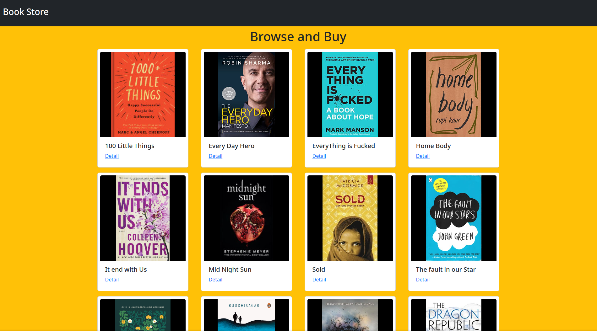
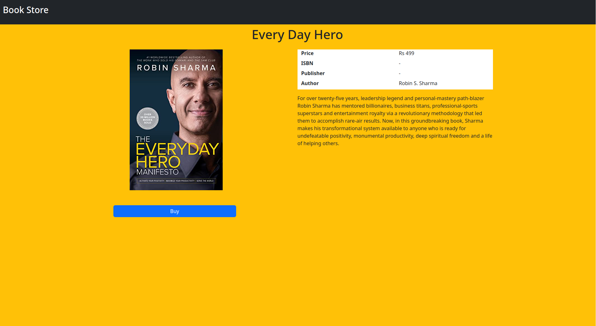

# Book Store
Using Stripe with react for payment.
This is he frontend module you can check out the backend [here](https://github.com/AashisMhj/node-apps/tree/main/book-store).


## Technologies Used
* react
* stripe 
* bootstrap

## Prerequisite
* node
* a package manager
* stripe account

## Installation guide
Before Starting you must first create a stripe account and generate keys.
You can follow [these steps](https://stripe.com/docs/keys).
Stripe is free for testing and you don't need to any credit card details.

*The following process use yarn but you can use the package manager you like*
```bash
# set up environment variables
# create a new file .env and copy the content of .env.example
# past your keys in the .env file
# API URL will be the url the backend is running

# install packages
yarn 

# start server
yarn start
```

## Screenshots

