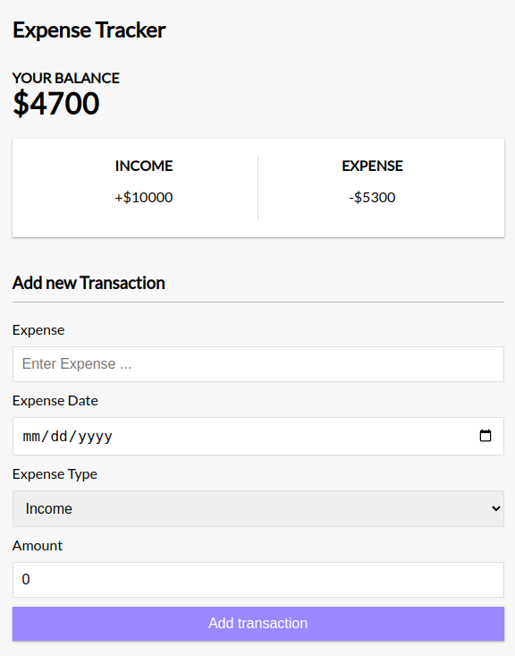
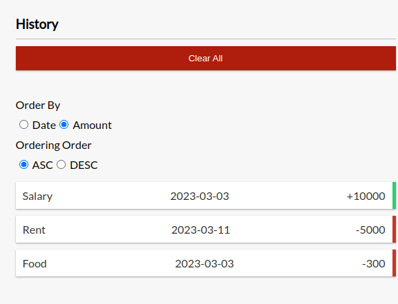

# Expense Tracker
Recoding your income and expense using IndexdDB. IndexdDB is client side web storage which provides us way to store data like a database.

## Technologies
1. Dexie.js: Wrapper for IndexdDB.
2. React

## Installation guide
```bash
# install packages
yarn

## run server
yarn start
```

## ScreenShots


