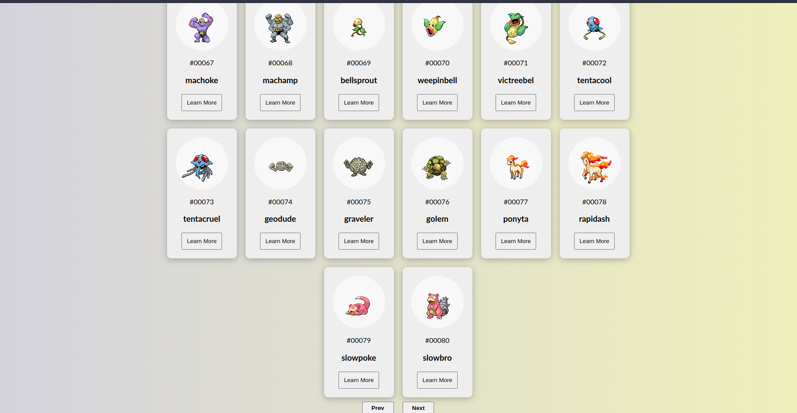
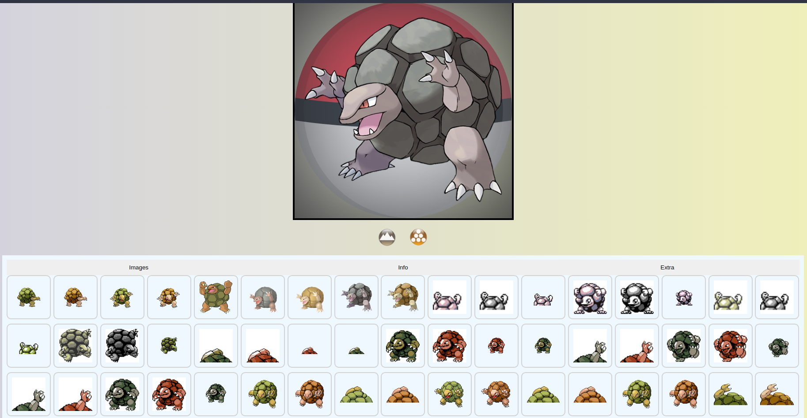
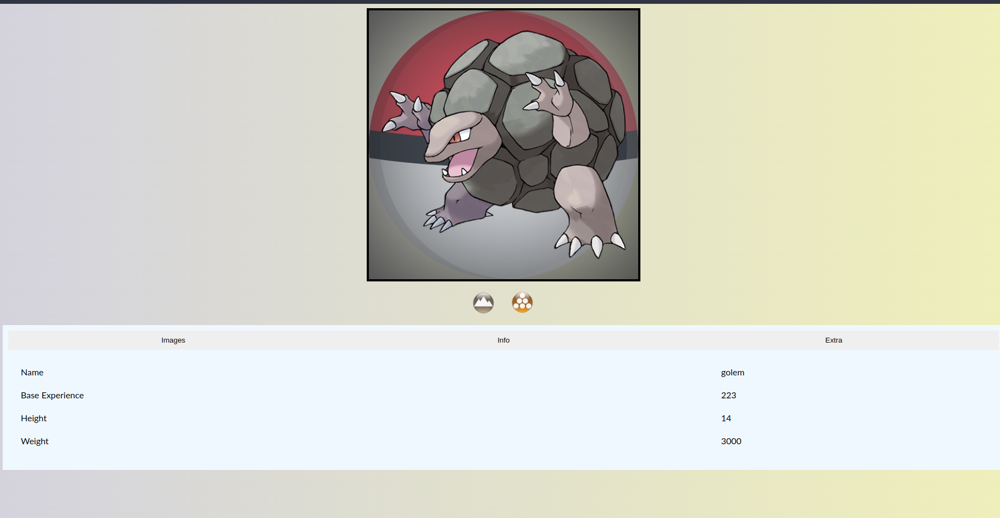
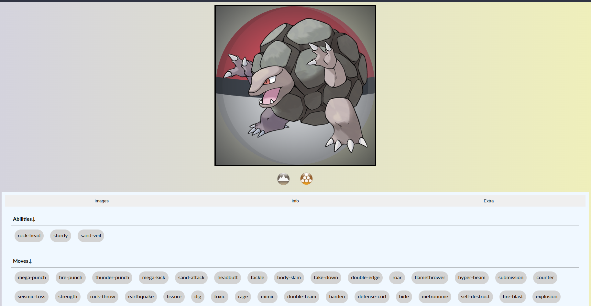

# Pokedex
Fetching Data from the poke api https://pokeapi.co/api/v2/.

## Technologies used
* axios
* react
* vite
* typescript

## Installation guide
```bash
# create .env file and copy the content of .env.example

# install packages
yarn

# run server
yarn dev
```

## Screenshots




