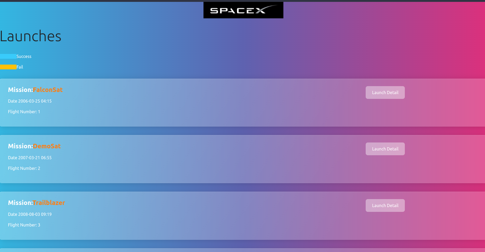

# SpaceX react app
A mini react project to fetch and display the list of launches and their details using graphql and apollo.
Design Using bootswatch for css template and theme.

Checkout [server](https://github.com/AashisMhj/node-apps/tree/main/spacex) for backend.

## Packages used
1. graphql : For writing graphql query
1. react-moment & moment: Date formatting
1. react-apollo: Query Interface provider
1. classnames: 
1. react-router-dom: For routing

## ScreenShots
